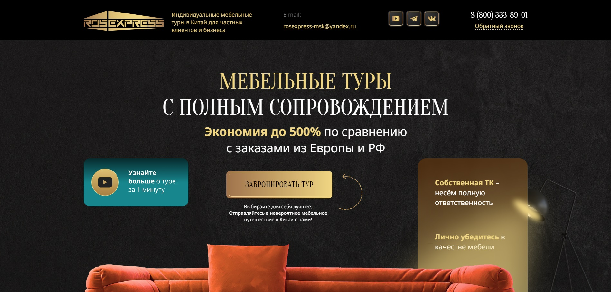
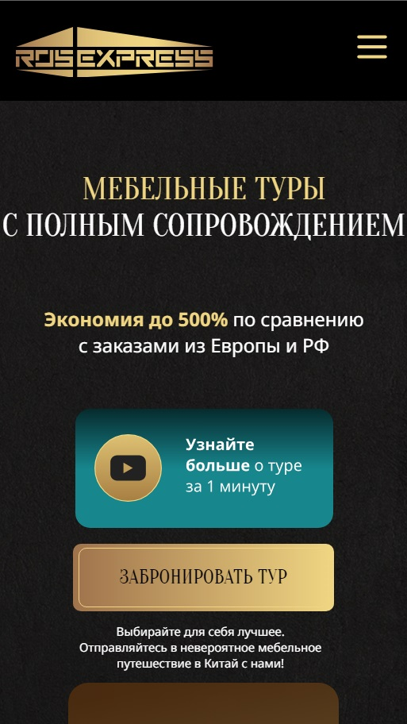

# Landing page b2b creative

## Table of contents

- [Overview](#overview)
  - [The challenge](#the-challenge)
  - [Screenshot](#screenshot)
  - [Links](#links)
- [My process](#my-process)
  - [Built with](#built-with)
  - [What I learned](#what-i-learned)
  - [Continued development](#continued-development)
  - [Useful resources](#useful-resources)
- [Author](#author)
- [Acknowledgments](#acknowledgments)

## Overview

### The challenge

Users should be able to:

- View the optimal layout depending on their device's screen size
- See hover states for interactive elements

- Get introductory info about company.
- Contact the company via email.

### The figma design

<p float="left">
  
</p>

### Screenshot

<p float="left">
  
  
</p>

### Links

- Repository URL: [Add solution URL here](https://github.com/coder-96/b2b-creative)

## My process

### Built with

Frontend:
- HTML5
- CSS3
- Flexbox
- CSS Grid

### What I learned

Improved my frontend skills once again, and gained more knowledge overall on Responsive Design, React JS.

```css

.left-plant {
    width: 50%;
    z-index: 1;
    margin-left: -25%;
    margin-bottom: -38%;
}

.left-plant > img {
    width: 100%;
    object-fit: contain;
}

```

### Continued development

I'm focused on perfecting my Full Stack skills by building more projects.

### Useful resources

- [MDN Web Docs](https://developer.mozilla.org/en-US/) - helped me find answers when I got stuck.

## Author

- Website - [Jalga](https://github.com/coder-96)

## Acknowledgments

I thank my family for supporting me on my way to becoming a Developer. 